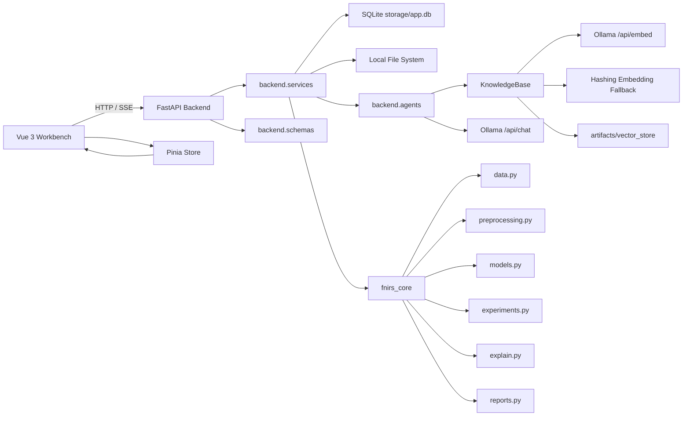
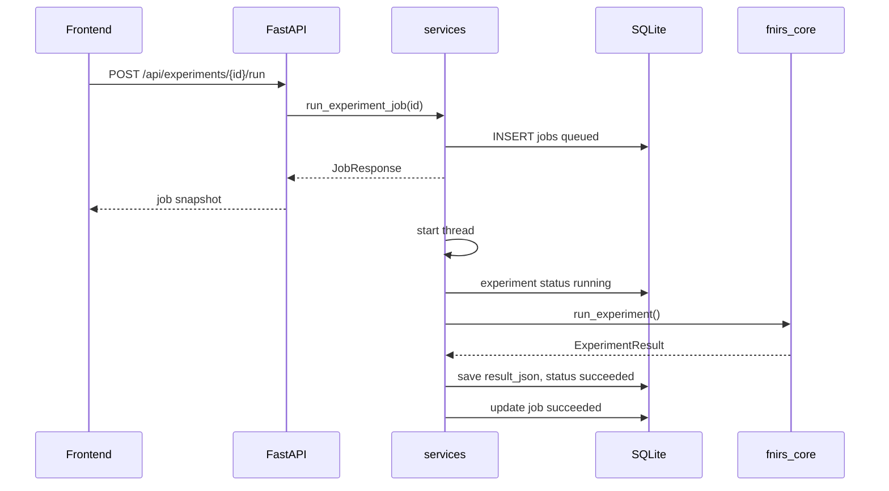
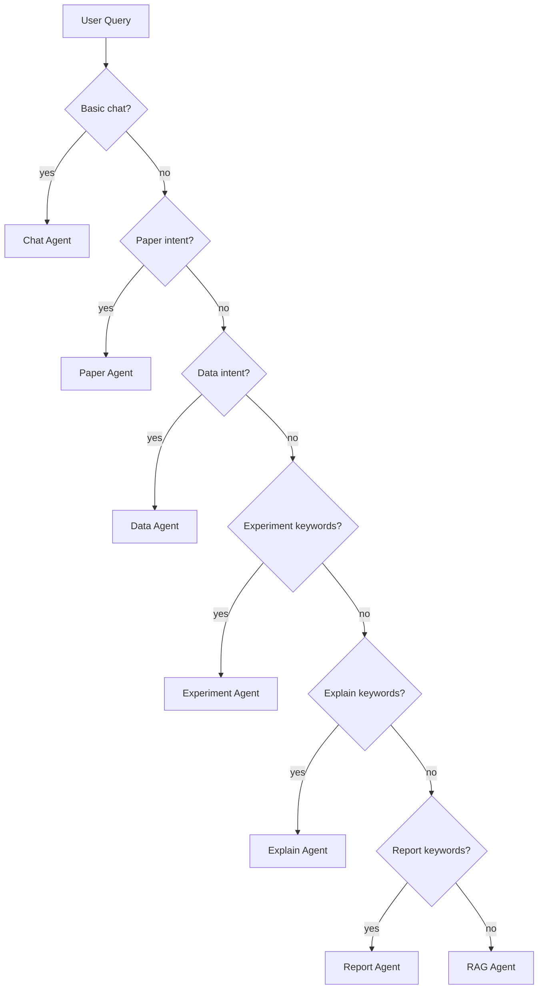
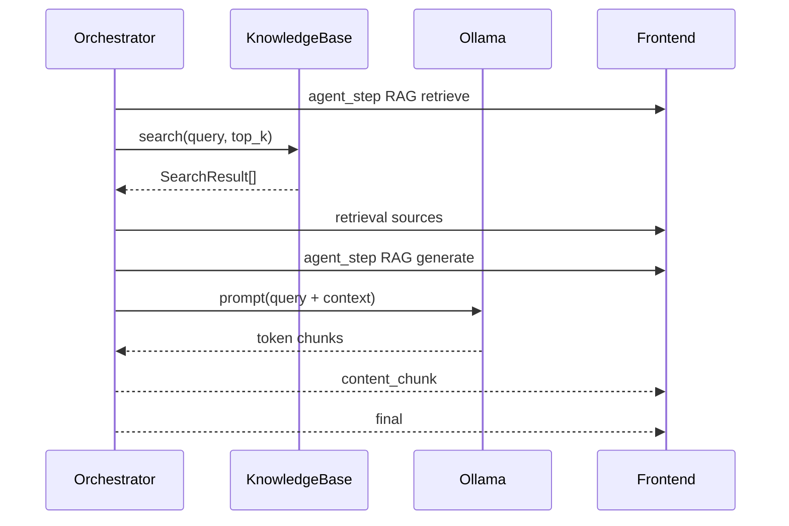
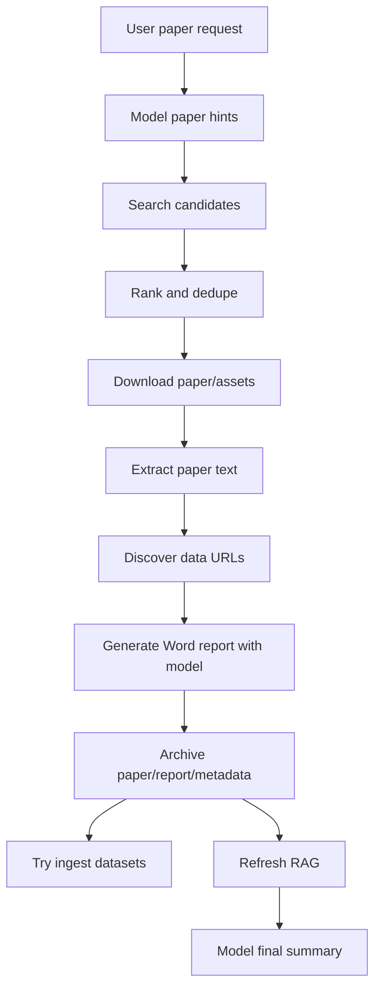
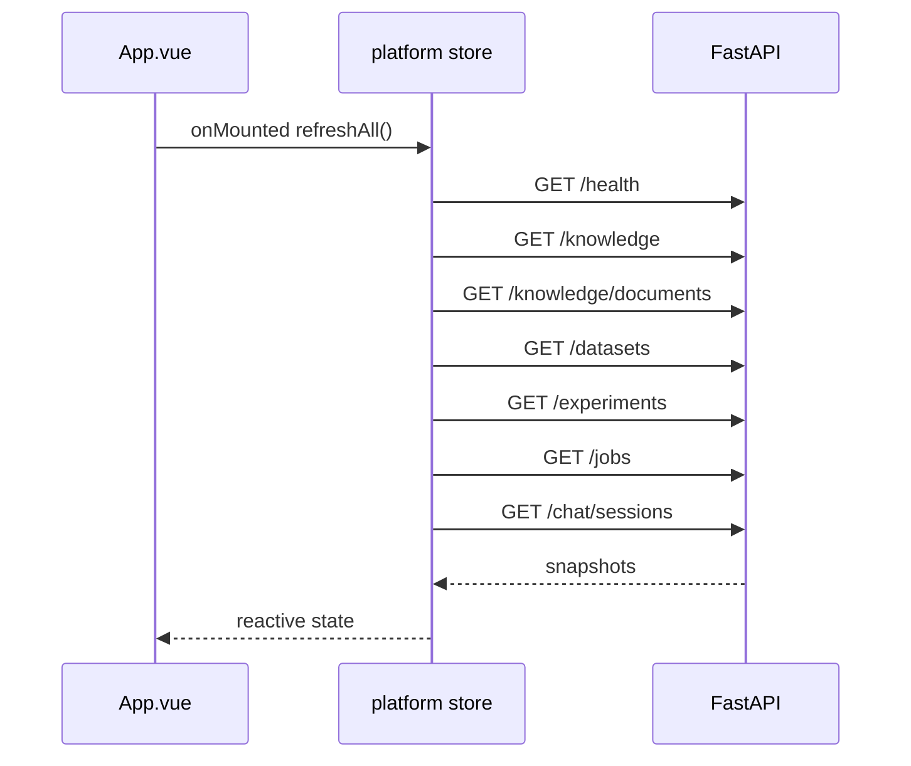
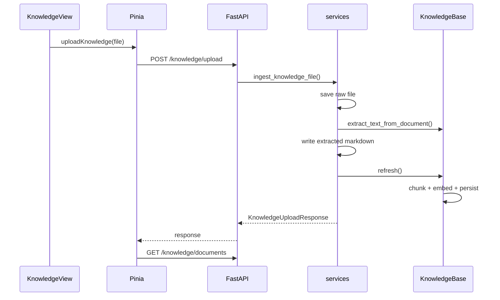
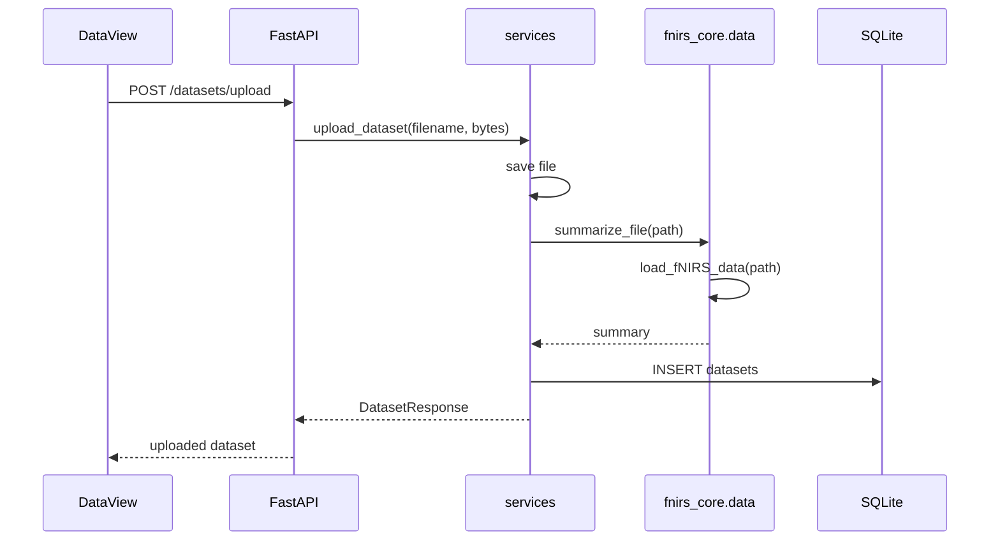
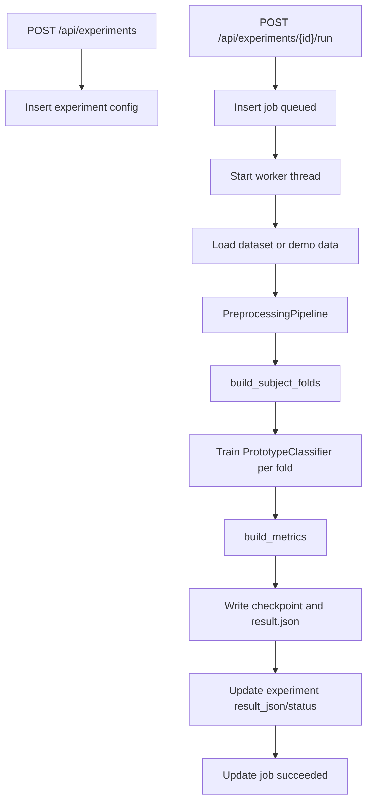
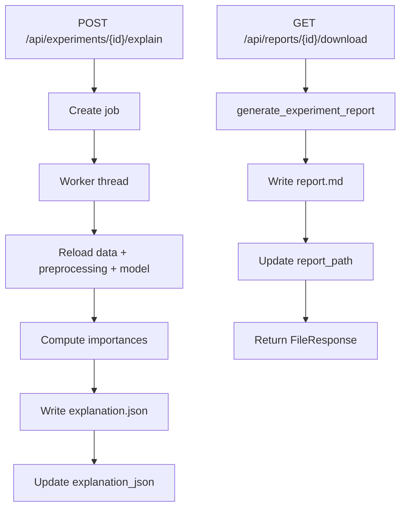

# fNIRS 深度学习多智能体自助平台架构文档

## 1. 架构概览

本项目采用本地三层架构：

- 前端工作台：Vue 3 + Vite + Pinia + Vue Router。
- 后端服务：FastAPI + Pydantic + SQLite + 本地文件系统。
- 领域核心：`fnirs_core`，提供数据解析、预处理、模型、实验、解释、报告和知识库能力。

智能能力通过本地 Ollama 接入：

- Chat 模型：默认 `qwen3:8b`。
- Embedding 模型：默认 `qwen3-embedding:8b`。
- Embedding 不可用时降级到本地 hashing embedding。

整体架构是 local-first 单用户设计。应用默认运行在本机，SQLite 保存元数据，`artifacts/`、`knowledge/` 和 `storage/` 保存文件与索引。



## 2. 分层原则

### 2.1 前端层

前端负责：

- 页面路由。
- 表单输入。
- 上传交互。
- SSE 流式对话解析。
- 状态展示。
- 删除确认。
- Toast 和上传进度。

前端不负责：

- fNIRS 数据解析。
- 实验训练。
- 知识库索引构建。
- 文件系统安全校验。
- 数据库写入。

### 2.2 API 层

API 层位于 `backend/main.py`。

职责：

- 定义 HTTP 路由。
- 使用 Pydantic schema 约束请求和响应。
- 接收上传文件。
- 包装 SSE。
- 把业务异常转换为 HTTP 错误。

API 层保持薄入口，不承载复杂业务逻辑。

### 2.3 服务层

服务层位于 `backend/services.py`。

职责：

- 初始化运行目录和数据库。
- 读取与更新运行配置。
- 构建知识库。
- 管理知识文档。
- 管理数据集。
- 管理实验。
- 管理后台任务。
- 管理聊天会话。
- 调用 `fnirs_core`。
- 调用多智能体编排器。

服务层是业务编排中心。

### 2.4 领域核心层

领域核心位于 `fnirs_core/`。

职责：

- 数据对象定义。
- 文件解析。
- 预处理。
- 模型接口和轻量分类器。
- subject-wise 实验运行。
- 指标计算。
- 可解释性计算。
- Markdown 报告生成。
- 本地知识库和向量索引。

领域核心不依赖 FastAPI，也不依赖 Vue。

## 3. 目录结构

```text
fnirs/
  backend/
    __init__.py
    agents.py
    db.py
    main.py
    papers.py
    schemas.py
    services.py
  fnirs_core/
    __init__.py
    data.py
    explain.py
    experiments.py
    knowledge.py
    models.py
    preprocessing.py
    reports.py
  frontend/
    index.html
    package.json
    vite.config.js
    src/
      App.vue
      api.js
      formatters.js
      main.js
      router/
      stores/
      views/
      components/
      styles.css
  docs/
    design_document.md
    architecture_document.md
    source_program_document.md
  knowledge/
    base/
    uploads/
      extracted/
  artifacts/
    datasets/
    experiments/
    knowledge_uploads/
    papers/
    reports/
    vector_store/
  storage/
    app.db
  tests/
  README.md
  requirements.txt
```

## 4. 后端架构

### 4.1 FastAPI 应用生命周期

`backend/main.py` 创建 FastAPI 应用，并在 lifespan 中调用 `ensure_runtime()`。

启动时执行：

1. 初始化 SQLite 表。
2. 创建运行目录。
3. 确保内置知识文档存在。
4. 加载或刷新知识库索引。

应用元信息：

```python
app = FastAPI(
    title="fNIRS Multi-Agent Platform API",
    version="1.0.0",
    lifespan=lifespan,
)
```

CORS 当前允许所有来源：

```text
allow_origins=["*"]
allow_methods=["*"]
allow_headers=["*"]
```

这是本地开发友好的设置，不适合直接公网部署。

### 4.2 路由分组

| 分组 | API | 职责 |
| --- | --- | --- |
| 健康与设置 | `/api/health`, `/api/settings` | 查看状态、修改模型名 |
| 总览 | `/api/dashboard` | 聚合健康、知识库、数据集、实验、任务 |
| 知识库 | `/api/knowledge/**` | 文档、chunk、上传、刷新 |
| 对话 | `/api/chat`, `/api/chat/stream`, `/api/chat/sessions/**` | 非流式/流式对话、会话管理 |
| 数据集 | `/api/datasets/**` | 上传、列表、摘要、删除 |
| 实验 | `/api/experiments/**` | 创建、列表、详情、运行、解释、结果删除 |
| 任务 | `/api/jobs/**` | 查看后台任务 |
| 报告 | `/api/reports/{experiment_id}/download` | 下载 Markdown 报告 |

## 5. 数据库架构

SQLite 数据库路径：

```text
storage/app.db
```

数据库由 `backend/db.py` 管理。

### 5.1 表结构

#### projects

当前用于保留默认项目记录。

| 字段 | 类型 | 说明 |
| --- | --- | --- |
| `id` | TEXT PK | 项目 ID |
| `name` | TEXT | 项目名称 |
| `created_at` | TEXT | 创建时间 |
| `updated_at` | TEXT | 更新时间 |
| `metadata_json` | TEXT | 扩展元数据 |

默认记录：

```text
project_default / 本地 fNIRS 工作台
```

#### chat_sessions

保存对话历史。

| 字段 | 类型 | 说明 |
| --- | --- | --- |
| `id` | TEXT PK | 会话 ID |
| `title` | TEXT | 会话标题，默认取用户消息前 60 字 |
| `messages_json` | TEXT | 消息列表 |
| `sources_json` | TEXT | 最新来源列表 |
| `agent_steps_json` | TEXT | 智能体步骤 |
| `created_at` | TEXT | 创建时间 |
| `updated_at` | TEXT | 更新时间 |

`messages_json` 格式示例：

```json
[
  {"role": "user", "content": "请说明 LOSO"},
  {"role": "assistant", "content": "LOSO 是..."}
]
```

#### datasets

保存数据集元数据。

| 字段 | 类型 | 说明 |
| --- | --- | --- |
| `id` | TEXT PK | 数据集 ID |
| `name` | TEXT | 数据集名称 |
| `filename` | TEXT | 原始文件名 |
| `path` | TEXT | 本地保存路径 |
| `suffix` | TEXT | 文件后缀 |
| `summary_json` | TEXT | 数据摘要 |
| `created_at` | TEXT | 创建时间 |
| `updated_at` | TEXT | 更新时间 |

#### experiments

保存实验配置、状态和结果。

| 字段 | 类型 | 说明 |
| --- | --- | --- |
| `id` | TEXT PK | 实验 ID |
| `name` | TEXT | 实验名称 |
| `dataset_id` | TEXT NULL | 关联数据集 ID |
| `config_json` | TEXT | 实验配置 |
| `status` | TEXT | `created/running/succeeded/failed` |
| `result_json` | TEXT NULL | 实验结果 |
| `explanation_json` | TEXT NULL | 解释结果 |
| `report_path` | TEXT NULL | 报告路径 |
| `created_at` | TEXT | 创建时间 |
| `updated_at` | TEXT | 更新时间 |

#### jobs

保存后台任务。

| 字段 | 类型 | 说明 |
| --- | --- | --- |
| `id` | TEXT PK | 任务 ID |
| `kind` | TEXT | `experiment_run` 或 `experiment_explain` |
| `status` | TEXT | `queued/running/succeeded/failed` |
| `progress` | REAL | 进度，0 到 1 |
| `message` | TEXT | 当前消息 |
| `payload_json` | TEXT | 任务参数 |
| `result_json` | TEXT NULL | 任务结果 |
| `error` | TEXT NULL | 错误消息 |
| `logs_json` | TEXT | 任务日志 |
| `created_at` | TEXT | 创建时间 |
| `updated_at` | TEXT | 更新时间 |

#### runtime_settings

保存运行时配置。

| 字段 | 类型 | 说明 |
| --- | --- | --- |
| `key` | TEXT PK | 配置键 |
| `value` | TEXT | 配置值 |
| `updated_at` | TEXT | 更新时间 |

当前可写键：

- `chat_model`
- `embedding_model`

### 5.2 ID 生成

`db.new_id(prefix)` 使用 UUID 前 12 位：

```text
{prefix}_{uuid12}
```

示例：

- `ds_8ce8b27dc8f7`
- `exp_a1b2c3d4e5f6`
- `job_012345abcdef`
- `chat_abcdef012345`

### 5.3 时间格式

时间统一使用 UTC ISO 格式：

```python
datetime.now(timezone.utc).isoformat()
```

前端显示时使用浏览器 locale 转为中文本地时间。

## 6. 文件系统架构

### 6.1 运行目录

`ensure_runtime()` 确保以下目录存在：

```text
artifacts/
artifacts/datasets/
artifacts/knowledge_uploads/raw/
knowledge/uploads/extracted/
artifacts/reports/
artifacts/experiments/
knowledge/base/
```

### 6.2 数据文件

上传数据集保存到：

```text
artifacts/datasets/{dataset_id}/{filename}
```

删除数据集时：

1. 删除 `datasets` 表记录。
2. 将关联实验的 `dataset_id` 置空。
3. 将关联实验 `config_json.dataset_id` 和 `config_json.dataset_path` 置空。
4. 删除受管数据集目录。

### 6.3 知识文档

上传原件：

```text
artifacts/knowledge_uploads/raw/{safe_filename}
```

抽取后 Markdown：

```text
knowledge/uploads/extracted/{safe_filename}.md
```

内置知识：

```text
knowledge/base/fnirs_platform_guide.md
```

### 6.4 向量库

向量库目录：

```text
artifacts/vector_store/
```

文件：

| 文件 | 说明 |
| --- | --- |
| `vectors.npz` | 压缩 NumPy 向量矩阵和 embedding 配置 |
| `metadata.json` | 文档、chunk、source roots、更新时间和启停状态 |

### 6.5 实验输出

实验输出目录：

```text
artifacts/experiments/{experiment_id}/
```

典型文件：

| 文件 | 说明 |
| --- | --- |
| `prototype_model.json` | 原型模型 checkpoint 元数据 |
| `result.json` | 实验结果 |
| `explanation.json` | 解释结果 |
| `report.md` | Markdown 报告 |

### 6.6 论文缓存与归档

论文下载缓存：

```text
artifacts/papers/{paper_folder}/
```

RAG 归档目录：

```text
knowledge/uploads/extracted/papers/{identity_key}_{title}/
```

典型文件：

| 文件 | 说明 |
| --- | --- |
| `paper.pdf` / `paper.txt` / `paper.docx` | 论文原文 |
| `reading_report.docx` | Word 阅读报告 |
| `paper_workflow.json` | 工作流元数据 |

## 7. 后端服务层架构

`backend/services.py` 是核心业务编排模块。

### 7.1 运行配置

配置来源：

1. 环境变量：
   - `FNIRS_OLLAMA_BASE_URL`
   - `FNIRS_CHAT_MODEL`
   - `FNIRS_EMBEDDING_MODEL`
2. SQLite `runtime_settings`。
3. 默认值：
   - `http://localhost:11434`
   - `qwen3:8b`
   - `qwen3-embedding:8b`

读取函数：

```python
get_runtime_config()
```

更新函数：

```python
update_runtime_config(chat_model=..., embedding_model=...)
```

### 7.2 健康检查

`probe_health()` 访问：

```text
{ollama_base_url}/api/tags
```

返回：

- API 状态。
- 数据库路径。
- Ollama 地址。
- Chat 模型名。
- Embedding 模型名。
- Ollama 状态。
- Chat 模型是否存在。
- Embedding 模型是否存在。
- 向量库路径。
- 提示信息。

Ollama 状态取值：

- `healthy`
- `down`
- `error`

模型状态取值：

- `ready`
- `missing`

### 7.3 知识库服务

核心函数：

| 函数 | 职责 |
| --- | --- |
| `build_default_knowledge_base()` | 根据运行配置构建 `KnowledgeBase` |
| `build_knowledge_status()` | 返回知识库统计 |
| `refresh_knowledge_base()` | 强制刷新向量库 |
| `list_knowledge_documents()` | 列出知识文档 |
| `get_knowledge_document()` | 获取文档正文和 chunks |
| `create_knowledge_document()` | 创建托管 Markdown |
| `update_knowledge_document()` | 更新托管 Markdown |
| `delete_knowledge_document()` | 删除托管文档 |
| `set_knowledge_chunk_enabled()` | 启停 chunk |
| `ingest_knowledge_file()` | 上传并抽取文档 |

### 7.4 数据集服务

核心函数：

| 函数 | 职责 |
| --- | --- |
| `upload_dataset()` | 保存文件、解析摘要、写数据库 |
| `list_datasets()` | 列出数据集 |
| `get_dataset()` | 获取数据集 |
| `delete_dataset()` | 删除数据集并解除实验引用 |

### 7.5 实验服务

核心函数：

| 函数 | 职责 |
| --- | --- |
| `create_experiment()` | 创建实验配置 |
| `list_experiments()` | 列出实验 |
| `get_experiment()` | 获取实验 |
| `delete_experiment()` | 删除实验、关联任务和输出 |
| `delete_experiment_results()` | 删除结果但保留实验配置 |
| `run_experiment_job()` | 创建并启动实验运行任务 |
| `explain_experiment_job()` | 创建并启动解释任务 |
| `generate_report()` | 生成 Markdown 报告 |

### 7.6 Job runner

当前任务运行方式：

- 创建 job 记录，初始状态 `queued`。
- 启动 daemon thread。
- 线程中更新状态和日志。
- 任务完成后写 result 或 error。

实验运行任务：



限制：

- 线程任务不是持久队列。
- 进程退出会中断正在运行的任务。
- 没有自动重试。
- 前端当前通过手动刷新查看任务状态。

## 8. 多智能体架构

### 8.1 主要类

`backend/agents.py` 中主要对象：

| 对象 | 说明 |
| --- | --- |
| `AgentStep` | 单个智能体步骤 |
| `AgentContext` | 一次请求的上下文 |
| `OllamaChatClient` | Ollama chat API 客户端 |
| `MultiAgentOrchestrator` | 路由和流式编排器 |

### 8.2 路由流程



### 8.3 SSE 输出

`POST /api/chat/stream` 返回 `text/event-stream`。

SSE 序列通常如下：

```text
status
agent_step
agent_step
retrieval
agent_step
content_chunk...
final
session
done
```

错误时：

```text
error
done
```

### 8.4 Ollama Chat 请求

Ollama chat 使用：

```text
POST {base_url}/api/chat
```

请求体：

```json
{
  "model": "qwen3:8b",
  "messages": [],
  "stream": true,
  "options": {"temperature": 0.2}
}
```

客户端逐行解析 Ollama JSON stream，将 `message.content` 作为增量文本返回。

### 8.5 RAG Agent 流程



RAG prompt 强调：

- 优先基于知识库上下文。
- 证据不足要说明边界。
- 涉及验证必须强调 subject-wise split、LOSO 或 Group K-Fold。

## 9. 论文工作流架构

论文模块位于 `backend/papers.py`。

### 9.1 主要对象

| 对象 | 说明 |
| --- | --- |
| `PaperCandidate` | 论文候选 |
| `DownloadedFile` | 下载文件 |
| `PaperMaterial` | 论文材料集合 |
| `PaperWorkflowResult` | 工作流结果 |
| `PaperWorkflowError` | 工作流错误 |

### 9.2 候选来源

候选论文来源：

- 用户直接提供的 URL。
- 模型生成的候选提示。
- Semantic Scholar。
- arXiv。
- Crossref。

注意：这些检索需要网络访问。网络不可用时，论文工作流可能失败。

### 9.3 处理流程



### 9.4 去重策略

论文目录 identity key：

1. 优先 DOI。
2. 没有 DOI 时使用规范化标题 SHA1。
3. 没有标题时使用 URL SHA1。

相同论文会复用同一个 RAG 归档目录。

## 10. 领域核心架构

### 10.1 data.py

职责：

- 定义 `NIRSData`。
- 加载多种 fNIRS 文件。
- 生成数据摘要。
- 提供 demo 数据。

主要公开接口：

| 接口 | 说明 |
| --- | --- |
| `load_fNIRS_data(file_path)` | 根据后缀加载文件 |
| `summarize_file(path)` | 返回数据摘要 |
| `make_demo_nirs_data()` | 生成 demo fNIRS 数据 |
| `NIRSData.get_epochs()` | 根据事件截取 epoch |

核心数据结构：

```text
raw_data: (n_channels, n_samples)
events: (n_events, 3)
hbo/hbr: optional same shape as raw_data
subject_ids: optional array
```

### 10.2 preprocessing.py

职责：

- 定义预处理配置。
- 执行预处理 pipeline。
- 输出 4D 实验张量。
- 在无事件时提供滑窗 fallback。

Pipeline：

```text
raw_data
  -> optical_density
  -> beer_lambert
  -> tddr
  -> bandpass_filter
  -> epoch extraction
  -> band stacking
  -> PreprocessingResult
```

带通滤波优先使用 SciPy `butter/filtfilt`，失败时退化到 FFT mask。

### 10.3 models.py

职责：

- 定义模型族注册表。
- 定义模型配置。
- 提供当前轻量分类器。

当前分类器：

```text
PrototypeClassifier
```

特征：

- mean。
- std。
- peak。
- trough。
- temporal_slope。
- TCN/Graph-TCN 额外加入 diff mean。
- Hybrid 3D CNN 额外加入 energy。

分类方式：

- 训练阶段按类计算标准化特征质心。
- 推理阶段计算样本到质心的距离。
- 使用距离负值做 softmax 概率。

### 10.4 experiments.py

职责：

- 定义实验配置。
- 加载数据。
- 调用预处理。
- 构建 subject-wise folds。
- 训练模型并计算 fold 指标。
- 保存结果。

实验流程：

```text
ExperimentConfig
  -> load_fNIRS_data or make_demo_nirs_data
  -> PreprocessingPipeline.run
  -> build_subject_folds
  -> create_model per fold
  -> fit / predict
  -> build_metrics
  -> write checkpoint/result.json
```

### 10.5 explain.py

职责：

- 基于实验配置重新构建数据和模型。
- 计算轻量解释结果。
- 写出 `explanation.json`。

输出：

- `channel_importance`
- `time_importance`
- `band_importance`
- `top_channels`
- `method`
- `output_path`

### 10.6 reports.py

职责：

- 生成 Markdown 实验报告。

输入：

- experiment payload。
- result。
- explanation。
- output_dir。

输出：

```text
report.md
```

### 10.7 knowledge.py

职责：

- 文本抽取。
- zip 安全解压。
- 文档发现。
- chunk 切分。
- embedding。
- 向量库持久化。
- 索引一致性检查。
- Top-K 检索。
- chunk 启停。

## 11. 知识库与向量索引架构

### 11.1 支持文档类型

```python
SUPPORTED_TEXT_SUFFIXES = {
  ".md", ".markdown", ".txt", ".text", ".pdf", ".docx", ".doc"
}
```

### 11.2 文本抽取

| 后缀 | 抽取方式 |
| --- | --- |
| `.md/.txt` | UTF-8 读取，忽略错误 |
| `.pdf` | `pypdf.PdfReader` |
| `.docx` | `python-docx` |
| `.doc` | 尝试 `utf-8`、`gb18030`、`latin-1` |
| `.zip` | 安全解压后选第一个支持文件 |

### 11.3 chunk 切分

默认参数：

```text
chunk_size = 1400
chunk_overlap = 180
```

策略：

- 优先按空行切段。
- 段落可合并时合并。
- 超长段落按固定长度滑窗切分。
- 保留 overlap。

### 11.4 Embedding

优先使用 Ollama：

```text
POST {base_url}/api/embed
```

请求体：

```json
{
  "model": "qwen3-embedding:8b",
  "input": ["text1", "text2"]
}
```

失败时使用：

```text
local-hashing-char-ngram
```

hashing 维度默认：

```text
4096
```

### 11.5 检索

检索流程：

1. 对 query 生成 embedding。
2. 如 query 向量维度与索引不一致，刷新索引。
3. 如 chunk 数与向量数不一致，刷新索引。
4. 使用点积相似度。
5. 按分数降序。
6. 跳过 disabled chunk。
7. 返回 top_k。

默认 top_k：

```text
FNIRS_RAG_TOP_K or 4
```

## 12. API 契约

### 12.1 健康与设置

#### GET /api/health

返回 `BackendStatusResponse`。

关键字段：

- `api_status`
- `database_path`
- `ollama_base_url`
- `chat_model`
- `embedding_model`
- `ollama_status`
- `chat_model_status`
- `embedding_model_status`
- `vector_store_path`
- `message`

#### PUT /api/settings

请求：

```json
{
  "chat_model": "qwen3:8b",
  "embedding_model": "qwen3-embedding:8b"
}
```

返回更新后的健康状态。

### 12.2 Dashboard

#### GET /api/dashboard

返回：

- `health`
- `knowledge`
- `datasets`
- `experiments`
- `jobs`

### 12.3 Knowledge

#### GET /api/knowledge

返回知识库统计。

#### POST /api/knowledge/refresh

刷新索引并返回统计。

#### GET /api/knowledge/documents

返回文档列表和知识库统计。

#### POST /api/knowledge/documents

请求：

```json
{
  "title": "文档标题",
  "content": "正文"
}
```

返回文档详情。

#### GET /api/knowledge/documents/{document_id}

返回文档详情，包括正文和 chunks。

#### PUT /api/knowledge/documents/{document_id}

更新托管文档。

#### PATCH /api/knowledge/documents/{document_id}/chunks/{order}

请求：

```json
{"enabled": false}
```

返回文档详情。

#### DELETE /api/knowledge/documents/{document_id}

删除托管文档并刷新索引。

#### POST /api/knowledge/upload

`multipart/form-data` 上传文件。

返回：

- 原文件路径。
- 抽取后文件路径。
- 抽取字符数。
- 文档摘要。
- 知识库统计。

### 12.4 Chat

#### POST /api/chat

非流式对话。

请求：

```json
{
  "message": "请说明 fNIRS LOSO 验证",
  "session_id": null
}
```

响应：

```json
{
  "output": "...",
  "sources": [],
  "agent_steps": [],
  "session_id": "chat_xxx"
}
```

#### POST /api/chat/stream

流式对话，返回 SSE。

#### GET /api/chat/sessions

列出最近 50 个会话。

#### GET /api/chat/sessions/{session_id}

获取会话详情。

#### DELETE /api/chat/sessions/{session_id}

删除会话。

### 12.5 Datasets

#### GET /api/datasets

列出数据集。

#### POST /api/datasets/upload

上传 fNIRS 数据文件。

#### GET /api/datasets/{dataset_id}/summary

获取数据集摘要。

#### DELETE /api/datasets/{dataset_id}

删除数据集。

### 12.6 Experiments

#### GET /api/experiments

列出实验。

#### POST /api/experiments

请求：

```json
{
  "name": "快速近红外实验",
  "dataset_id": "ds_xxx",
  "preprocessing": {},
  "model": {"model_family": "cnn-lstm"},
  "validation_strategy": "loso",
  "num_folds": 5,
  "seed": 42
}
```

#### GET /api/experiments/{experiment_id}

获取实验详情。

#### DELETE /api/experiments/{experiment_id}

删除实验、任务和输出。

#### POST /api/experiments/{experiment_id}/run

创建实验运行 job。

#### GET /api/experiments/{experiment_id}/results

返回：

- experiment。
- result。
- explanation。
- report_path。

#### DELETE /api/experiments/{experiment_id}/results

删除结果、解释和报告，保留实验配置。

#### POST /api/experiments/{experiment_id}/explain

创建解释 job。

### 12.7 Jobs

#### GET /api/jobs

返回最近 20 个任务。

#### GET /api/jobs/{job_id}

返回任务详情。

### 12.8 Reports

#### GET /api/reports/{experiment_id}/download

生成或更新 Markdown 报告并返回文件下载。

## 13. 前端架构

### 13.1 技术栈

| 技术 | 用途 |
| --- | --- |
| Vue 3 | 页面组件 |
| Vite | 开发与构建 |
| Vue Router | 路由 |
| Pinia | 状态管理 |
| Axios | 普通 HTTP 请求 |
| Fetch | SSE 流式对话 |

### 13.2 入口

`frontend/src/main.js` 创建 Vue 应用。

`frontend/src/App.vue` 提供：

- 左侧导航。
- 品牌区。
- 健康状态提示。
- `<RouterView />`。
- 全局反馈组件。

### 13.3 路由

`frontend/src/router/index.js` 定义：

| path | component |
| --- | --- |
| `/` | `DashboardView` |
| `/chat` | `ChatView` |
| `/knowledge` | `KnowledgeView` |
| `/data` | `DataView` |
| `/experiments` | `ExperimentsView` |
| `/results` | `ResultsView` |
| `/settings` | `SettingsView` |

### 13.4 API 客户端

`frontend/src/api.js`：

- 创建 Axios 实例，`baseURL="/api"`。
- 请求 timeout 为 600000 ms。
- 提供 `getApiError()`。
- 提供 `streamChat()`。

`streamChat()` 使用 fetch 读取 `ReadableStream`，解析 SSE block：

```text
event: content_chunk
data: {"content":"...", "assembled":"..."}
```

### 13.5 Platform Store

`frontend/src/stores/platform.js` 是主要业务状态。

核心 state：

- `health`
- `knowledge`
- `documents`
- `activeDocument`
- `datasets`
- `experiments`
- `jobs`
- `activeExperimentId`
- `sessionId`
- `chatSessions`
- `messages`
- `sources`
- `agentSteps`
- `timeline`
- loading flags

核心 actions：

- `refreshAll`
- `refreshHealth`
- `updateRuntimeConfig`
- `refreshKnowledge`
- `refreshDocuments`
- `uploadKnowledge`
- `createKnowledge`
- `updateKnowledge`
- `toggleChunk`
- `deleteKnowledge`
- `refreshDatasets`
- `uploadDataset`
- `deleteDataset`
- `refreshExperiments`
- `createExperiment`
- `runExperiment`
- `explainExperiment`
- `deleteExperiment`
- `deleteExperimentResults`
- `refreshJobs`
- `refreshChatSessions`
- `loadChatSession`
- `deleteChatSession`

### 13.6 Feedback Store

`frontend/src/stores/feedback.js` 管理：

- toast。
- 上传进度。
- 确认弹窗。

用于所有删除、上传和错误提示场景。

### 13.7 组件

| 组件 | 职责 |
| --- | --- |
| `MetricTile.vue` | 指标块 |
| `JobMonitor.vue` | 任务列表和进度条 |
| `RightRail.vue` | 对话历史、智能体步骤、检索来源 |
| `FeedbackHost.vue` | Toast、上传进度、确认框 |

### 13.8 格式化与中文映射

`frontend/src/formatters.js` 负责：

- 状态中文化。
- job kind 中文化。
- agent/action 中文化。
- 模型族中文化。
- 验证策略中文化。
- fold 名称格式化。
- fallback warning 中文化。
- JSON key 中文化。

这让后端保留稳定英文状态码，前端负责展示层翻译。

## 14. 主要运行时流程

### 14.1 页面初始化



### 14.2 知识上传流程



### 14.3 数据上传流程



### 14.4 实验运行流程



### 14.5 解释与报告流程



## 15. 错误处理架构

### 15.1 后端异常类型

| 异常 | 来源 | 用途 |
| --- | --- | --- |
| `KnowledgeBaseError` | `fnirs_core.knowledge` | 知识库解析、索引、查询错误 |
| `NIRSDataError` | `fnirs_core.data` | 数据解析错误 |
| `PreprocessingError` | `fnirs_core.preprocessing` | 预处理错误 |
| `ModelError` | `fnirs_core.models` | 模型构建或训练错误 |
| `ExperimentError` | `fnirs_core.experiments` | 实验运行错误 |
| `PaperWorkflowError` | `backend.papers` | 论文工作流错误 |
| `KeyError` | service 层 | 资源不存在 |
| `ValueError` | service 层 | 请求参数或路径边界错误 |

### 15.2 HTTP 错误转换

典型转换：

- 资源不存在：404。
- 上传或配置错误：400。
- 流式对话异常：SSE `error` event。

### 15.3 前端错误展示

前端通过 `getApiError()` 提取：

1. `error.response.data.detail`
2. `error.message`
3. fallback 文本

然后交给 `feedback.error()` 展示。

## 16. 安全边界

### 16.1 Zip 安全解压

知识库和数据模块都使用路径检查：

```python
target = (destination / member.filename).resolve()
target.relative_to(destination)
```

如果 `relative_to` 失败，则说明成员路径逃逸了解压目录，立即拒绝。

### 16.2 删除路径校验

删除目录和文件时使用：

- `_remove_tree_if_under(path, root)`
- `_remove_file_if_under(path, root)`
- `_remove_report_file(path)`

这些函数先 resolve，再校验目标位于受管 root 下。

### 16.3 上传后缀白名单

知识文档和数据集分别有后缀白名单。后端拒绝未知后缀，不仅依赖前端 `accept`。

### 16.4 运行环境限制

当前架构没有鉴权、CSRF 防护和公网安全配置，只适合本地可信环境。

## 17. 测试架构

测试位于：

```text
tests/
```

### 17.1 core 测试

`tests/test_core.py` 覆盖：

- 知识库 fallback 检索。
- chunk overlap。
- embedding 模型变化导致索引失效。
- 知识 zip 路径穿越拒绝。
- demo 预处理。
- 无事件 fallback。
- quick experiment。
- 无事件 CSV 实验。
- ragged CSV。
- MAT 结构体信号解析。
- zip 跳过不可解析候选。
- 论文目录复用。
- 数据 zip 路径穿越拒绝。

### 17.2 API 测试

`tests/test_api.py` 覆盖：

- 聊天会话保存、读取和删除。
- 多轮会话只展示最新一轮 agent steps。
- 数据集、实验和结果删除。
- runtime model settings 持久化。
- 身份问题路由到 chat。
- 训练问题路由到 experiment。
- fNIRS 定义路由到 RAG。
- 论文请求路由到 paper workflow。

### 17.3 测试隔离

测试通过 monkeypatch 修改：

- `db.STORAGE_DIR`
- `db.DB_PATH`
- `services.ARTIFACTS_DIR`
- `services.DATASET_DIR`
- `services.EXTRACTED_KNOWLEDGE_DIR`
- `services.EXPERIMENT_DIR`
- `services.BASE_KNOWLEDGE_DIR`

这样测试不会污染真实工作区数据。

## 18. 部署与启动架构

### 18.1 后端启动

```powershell
python -m pip install -r requirements.txt
python -m uvicorn backend.main:app --host 127.0.0.1 --port 8000
```

### 18.2 前端启动

```powershell
cd frontend
npm install
npm run dev -- --host 127.0.0.1 --port 5173
```

### 18.3 Ollama 启动

```powershell
ollama pull qwen3:8b
ollama pull qwen3-embedding:8b
ollama serve
```

### 18.4 前端代理

Vite 配置应将 `/api` 转发到后端，开发时浏览器访问：

```text
http://127.0.0.1:5173
```

前端 API baseURL 为：

```text
/api
```

## 19. 性能与容量考虑

### 19.1 当前适用规模

当前适合：

- 本地单用户。
- 中小型知识库。
- 小到中等 fNIRS 数据文件。
- 原型级实验验证。

### 19.2 可能瓶颈

- 知识库刷新会一次性读取全部文档并重建向量。
- embedding 通过 Ollama HTTP 串行 batch 调用，较大知识库耗时明显。
- 向量检索使用内存矩阵点积，没有专用 ANN 索引。
- 后台任务使用线程，不适合大量并发任务。
- 大型 MAT/SNIRF 文件会占用内存。
- `PrototypeClassifier` 不是高性能训练框架。

### 19.3 可优化方向

- 使用 FAISS 或 hnswlib。
- 增量索引。
- 文档级 dirty check。
- 后台任务队列。
- job 自动轮询。
- 数据摘要缓存。
- 分块读取大型文件。

## 20. 扩展点

### 20.1 替换真实深度学习模型

可扩展位置：

- `fnirs_core/models.py`
- `fnirs_core/experiments.py`

建议接口保持：

- `create_model(config)`
- `fit(x, y)`
- `predict(x)`
- `predict_proba(x)`
- `explain_features(x, y)`

### 20.2 增加预处理方法

可扩展位置：

- `PreprocessConfig`
- `PreprocessingPipeline.run`

注意：

- 输出仍应保持 `(epochs, bands, channels, times)`。
- summary 应记录关键参数和 warning。

### 20.3 增加文件格式

可扩展位置：

- `SUPPORTED_DATA_SUFFIXES`
- `load_fNIRS_data`
- 新增 `_load_xxx`

注意：

- 必须输出标准 `NIRSData`。
- zip 解析仍应保留安全校验。

### 20.4 增加 Agent

可扩展位置：

- route keywords。
- `MultiAgentOrchestrator.stream` 分支。
- `build_agent_prompt`。
- 前端 `formatters.js` 的 agent/action 映射。

### 20.5 增加报告格式

可扩展位置：

- `fnirs_core/reports.py`
- `/api/reports/{experiment_id}/download`

可新增：

- PDF。
- DOCX。
- HTML。

## 21. 当前架构限制

- 无登录鉴权。
- 无项目级隔离。
- 无生产部署配置。
- 无持久任务队列。
- 无多进程 job 状态同步。
- 无大型向量库 ANN。
- 对话生成强依赖 Ollama chat。
- 论文工作流依赖外部网络。
- 当前模型与解释为轻量原型实现。

## 22. 架构结论

当前架构以“本地可用的研究闭环”为第一优先级。前端提供清晰工作台，后端服务层集中编排，`fnirs_core` 保持领域能力独立可测，SQLite 和文件系统负责可追踪存储，Ollama 提供本地智能能力，hashing embedding 和 demo/fallback 路径保证平台在模型或数据不完整时仍能运行。

该架构适合当前阶段的本地自助平台，也为后续替换真实深度学习训练、增强任务队列、增加报告格式和扩展多用户能力预留了明确边界。
